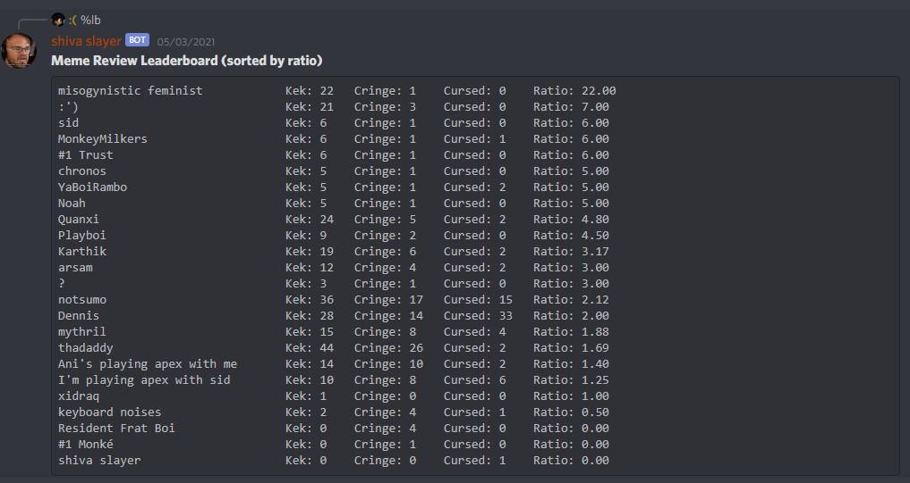
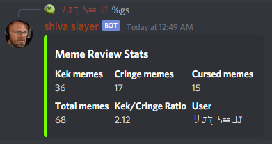

# Meme review bot!

## What does this thing do?
* Basically, it's a very super-duper specialized bot for tracking meme reviews in a discord server.

## How does it work tho?
* So when someone sends a meme in a Discord server, you can have some designated member review that meme and decide if 
  it's kek, cringe, or cursed.  When that meme gets reviewed, this bot will keep track of that and store it so people can 
  see how many kek, cringe, and cursed memes anyone in the server has sent.  It even has a leaderboard and everything!
  
* You need to have a dedicated "meme review" channel (it doesn't need to be called that, but its only purpose should be
  for sending and reviewing memes).
    
* You also need a  dedicated "meme reviewer" role, so the bot knows who the person reviewing the memes is.  
  
* So when the meme reviewer reacts or replies to a meme with one of the emotes designating a kek, cringe, or cursed
  rating, the bot will store that in a local sqlite database.  When someone runs the `getstats` or `leaderboard`
  command, the bot will query the database and get the necessary information to generate the required reply.  
  
  
### here's a few images of what the stat's and leaderboard look like

